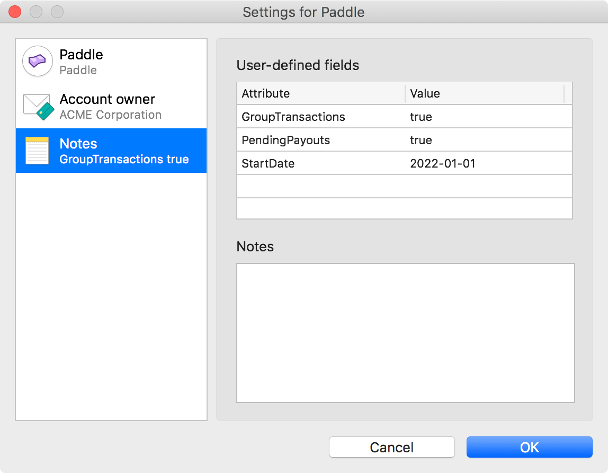

# Paddle extension for MoneyMoney

This extension for [MoneyMoney](https://moneymoney-app.com/) retrieves the balance and transactions of [Paddle](https://www.paddle.com) vendor accounts and optionally downloads the payout invoices to the MoneyMoney statements view.

## How to use

### Installation

1. Download the signed extension file of the [latest release](https://github.com/lukasbestle/moneymoney-paddle/releases/latest).
2. Open the database directory of MoneyMoney as described on the [MoneyMoney website](https://moneymoney-app.com/extensions/).
3. Place the extension file (`Paddle.lua`) in the `Extensions` directory of your MoneyMoney database.
4. Add a new account of type "Paddle". You can log in with your credentials for <https://vendors.paddle.com>. Paddle accounts with enabled 2FA are supported.

### Setup account refresh

The first account refresh cycle of your newly created account will fail (i.e. MoneyMoney will not display a balance or any transactions in your Paddle account). This is because you first need to set required configuration options.

To set the options, right-click on your Paddle account in the MoneyMoney sidebar, open the account settings and switch to the "Notes" page. There you will find a table for user-defined fields:

The `GroupTransactions` option is required, the other options are optional (see below). Please set the options you like, confirm the settings dialog and manually refresh your account.

### Setup invoice downloads

If you want MoneyMoney to automatically download your Paddle invoices from your configured start date, please open the MoneyMoney statements settings and enable the toggle for your Paddle account. MoneyMoney will automatically download your invoices immediately.

## Options

### `GroupTransactions: true | false` (required)

To keep the size of your MoneyMoney database sane, this option allows to create groups of all similar transactions of the same day. Instead of a single transaction per order, subscription purchase and refund, you will see one transaction for all orders, one for all subscription purchases and one for all refunds of the same day, e.g. like so:

> **5 orders**  
> Average: 92.57 EUR

To get this behavior, please set the option to `true`. If you prefer to get the original data from Paddle without grouping, set it to `false`.

### `PendingPayouts: true | false` (defaults to `true`)

Paddle already subtracts a payout from the balance on the first day of the month, but the actual day of the bank transfer may be much later. If you use an account group in MoneyMoney for your bank account and Paddle account, you would see a large gap between the first of the month and the day of the payout bank transfer.

This extension works around this issue by default. This has the following effects:

- Payouts that have not yet been transferred are displayed as a pending transaction in MoneyMoney.
- While a payout is pending, the displayed account balance is increased by the amount of the payout.
- The booking day of a transferred payout is set to the day of the transfer.

If you prefer the unmodified data from Paddle, set the option to `false`.

### `StartDate: YYYY-MM-DD` (defaults to one year ago)

If you have a large account history, you may not want to download all past transactions and invoices. With this option, you can set a start date in ISO 8601 format (`YYYY-MM-DD`).

**Note:** A start date beyond one year ago is not supported. This is because Paddle only displays the latest 15 payouts on the first page of the payouts view, so the logic for pending payouts would fail on older payouts. If you want to see older transactions or invoices in MoneyMoney, please import them manually.
